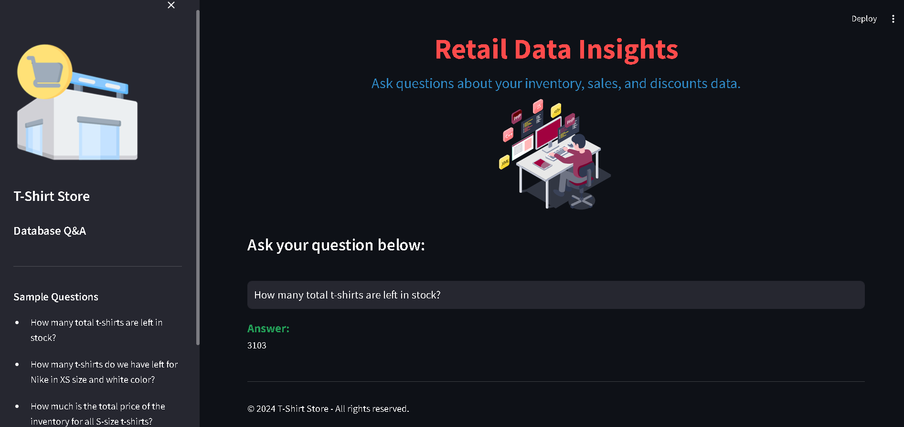

# GenAI Retail Industry Project

This project implements an end-to-end Language Model (LLM) system that can interact with a MySQL database. Users can ask questions in natural language, and the system generates answers by converting these questions into SQL queries and executing them on the MySQL database.

## Project Overview

The system is designed to handle queries related to retail inventory, sales, and discounts data stored in a MySQL database. It can answer questions such as:

- How many white color Adidas t-shirts do we have left in stock?
- How much sales will our store generate if we sell all extra-small size t-shirts after applying discounts?

## APP Sample Image


## Technology Stack

- Google Gemini
- Hugging Face embeddings
- Streamlit for UI
- Langchain framework
- Chromadb as a vector store
- Few-shot learning

## Project Structure

```
genai_retail_industry_project
 ┣ database
 ┃ ┗ create_db.sql
 ┣ exp
 ┃ ┗ testing.ipynb
 ┣ src
 ┃ ┣ __pycache__
 ┃ ┃ ┣ __init__.cpython-310.pyc
 ┃ ┃ ┣ langchain_sql.cpython-310.pyc
 ┃ ┃ ┗ utils.cpython-310.pyc
 ┃ ┣ __init__.py
 ┃ ┣ langchain_sql.py
 ┃ ┗ utils.py
 ┣ README.md
 ┣ app.py
 ┗ requirements.txt
```

## Installation

1. Clone this repository to your local machine:  
   ```
   git clone https://github.com/yourusername/genai_retail_industry_project.git
   ```

2. Navigate to the project directory:
   ```
   cd genai_retail_industry_project
   ```

3. Install the required dependencies:
   ```
   pip install -r requirements.txt
   ```

4. Create a `.env` file in the root directory and add your Google API key:
   ```
   GOOGLE_API_KEY="your_api_key_here"
   ```

## Usage

1. Run the Streamlit app:
   ```
   streamlit run app.py
   ```

2. The web app will open in your browser where you can ask questions about the retail data.

## Sample Questions

- How many total t-shirts are left in stock?
- How many t-shirts do we have left for Nike in XS size and white color?
- How much is the total price of the inventory for all S-size t-shirts?
- How much sales amount will be generated if we sell all small size Adidas shirts today after discounts?

## License

This project is licensed under the MIT License.

## Acknowledgments

This project was developed as part of a learning exercise in applying reinforcement learning to robotic simulations. Special thanks to the open-source community for providing the tools and libraries that made this project possible.
